# Как сделать драйвер
## General info
Работа выполнена ПРИМЕРНО для номера варианта 1.

Host machine - основной компьютер, НЕ виртуалка

## Prerequisites
On host machine:

- WinDbg - С помощью него мы будем отлаживать при необходимости код и смотреть дебаг сообщения ядра

- Visual Studio - Нужен для компиляции кода для общения с драйвером

- VirtualBox - Запускаем винду XP

- VSCode - Что нибудь чтобы писать код

## Few words on Visual Studio
Нам понадобится компонент для компиляции под Windows XP i386. 
Для его установки необходимо запустить Visual Studio Installer и выбрать **изменить**.

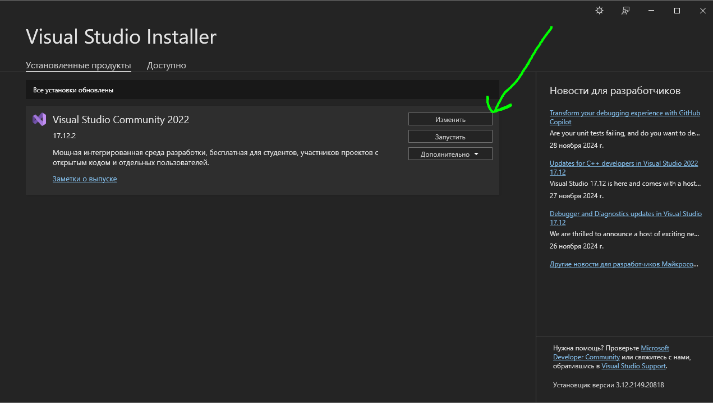

Дальше необходимо выбрать компонент для разработки на C/C++ в целом
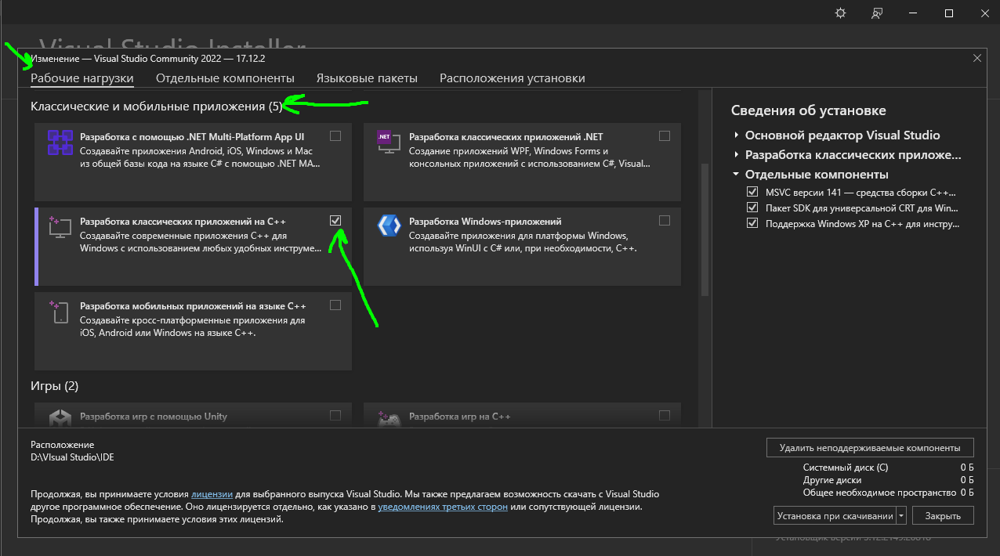

Дальше заходим в отдельные компоненты и вводим в поиск строку `"xp"`. Выбираем и его тоже
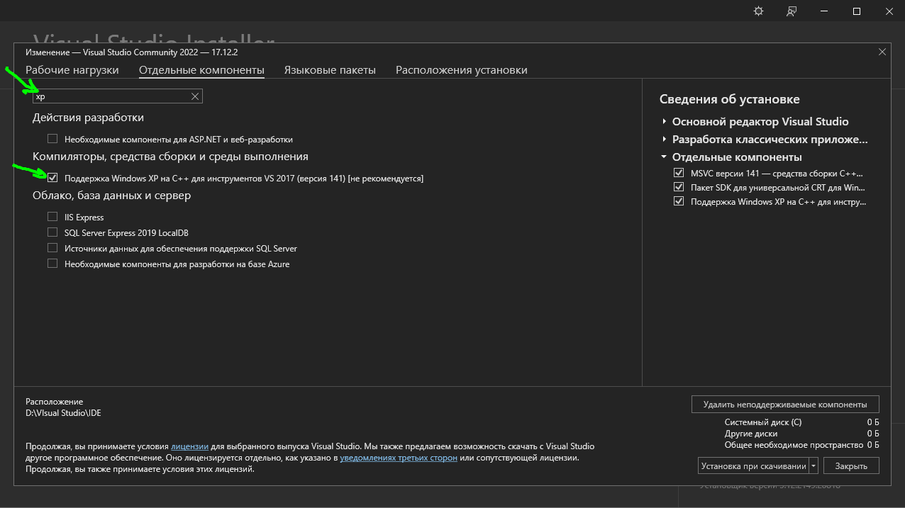

Вся эта шляпа весит нереальное количество мегабутов, так что возможно вы захотите выбрать альтернативное место установки. Если это так - самая правая вкладка для вас.
> Может случиться такое, что установщик не позволит вам поменять место установки - в таком случае надо целиком удалить Visual Studo и при установке с нуля выбрать нужное место установки.

Следующая проблема которая может возникнуть, помимо того что вы потеряете смысл существования, у вас не будет компилироваться даже самый простой hello world проект. Если при компиляции у вас выдается ошибка линковки `"ucrtd.lib"` библиотека не найдена или что то подобное - вам необходимо сделать следующее:

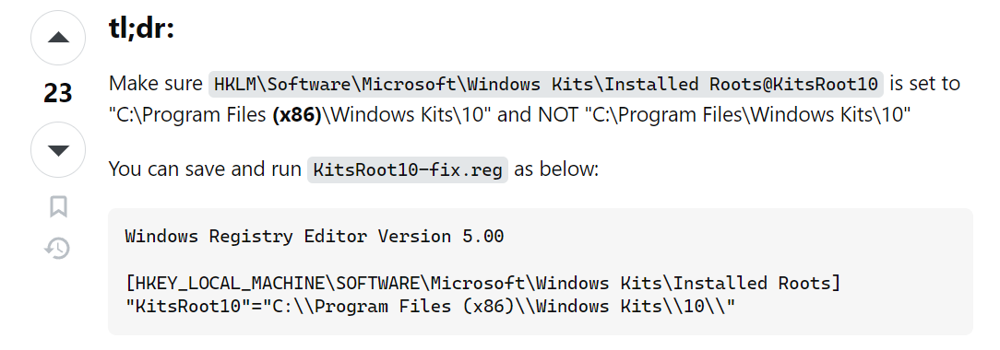

Зайти в реестр с помощью `Win + R > regedit` и поправить значение с картинки сверху.

Если вдруг у вас при компиляции не найден какой либо заголовочный файл из библиотеки C - то дай бог вам здоровья. Я не нашел прямого решения этой проблеме, но после переустановки IDE вроде пришла в себя.

## Настраиваем виртуальную машину

Первое что вы должны сделать это скачать [виртуальный диск](https://disk.yandex.ru/d/ha6y7_uLZfIUKQ) с яндекс диска Фёдора Михайловича.
Дальше создаем виртуальную машину как показано на рисунке
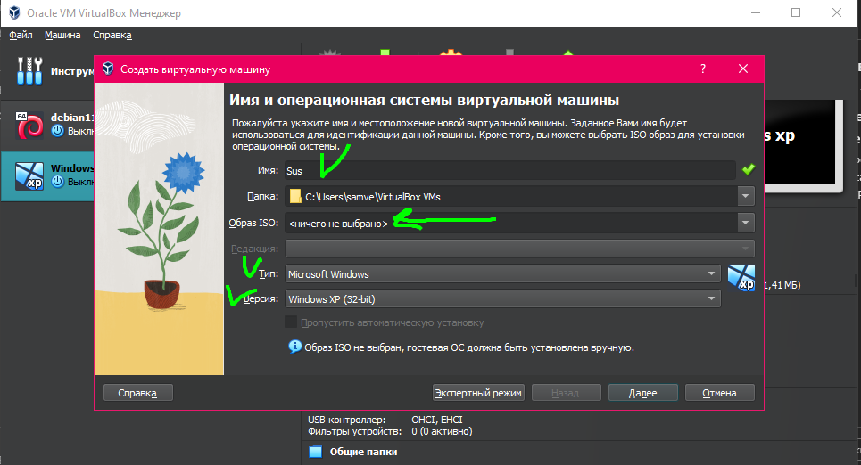

Далее естественно на ваш вкус, но например можно поставить вот такие параметры
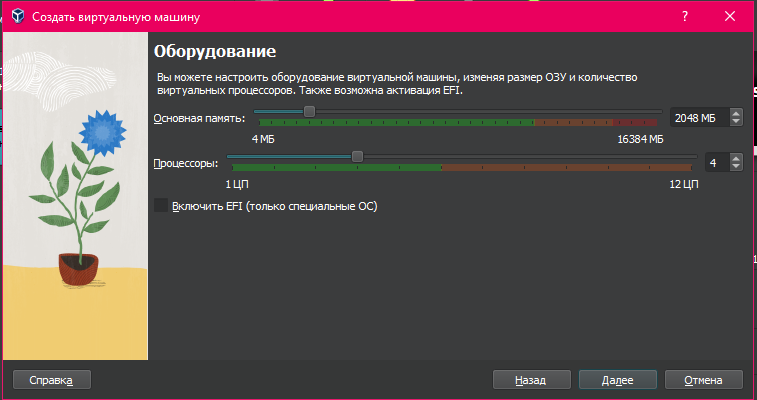

После этого очень важно - выбираем `Использовать существующий жесткий диск`. Если надо - указываем путь к нему
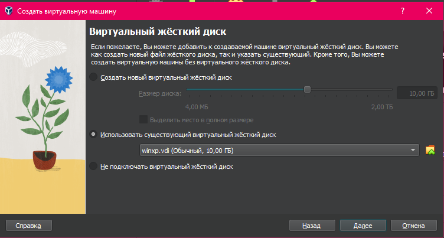

Дальше произойдет подготовка машины и она будет готова к запуску.

Следующее что надо сделать это настроить порты в параметрах виртуальной машины. Необходимо выставить следующие параметры

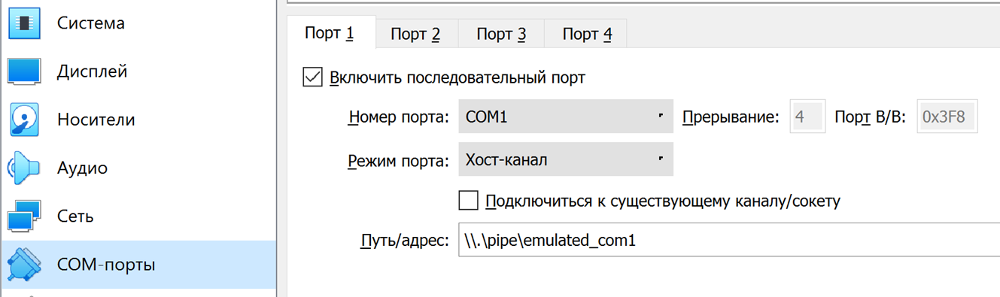

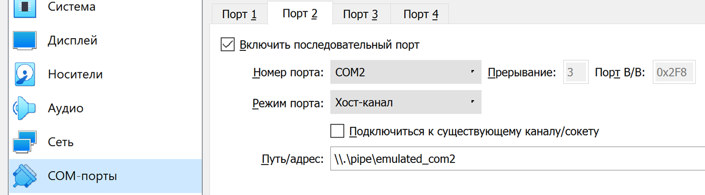

Порт `COM1` будет использоваться для дебага системного ядра из WinDbg.

Запускаем настройки с помощью комбинации `Win + R` и вводим `msconfig`. 
В настройках системы на виртуалке надо выставить параметры как указано на рисунке

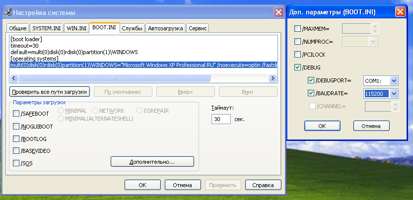

> Не торопитесь перезапускать систему - сначала настройте WinDbg, иначе вам придется перезапускаться два раза.
Этот порт будет использован для просмотра дебага из WinDbg. Также мы включаем параметр DEBUG чтобы видеть отладочную информацию.

На хосте необходимо открыть WinDbg.
В нем надо сделать следующее
- Зайти в меню `File > Kernel Debug`, выбрать вкладку «COM»
- Установить имя порта `\\.\pipe\emulated_com1`, выставить флаги «Pipe» и «Reconnect», нажать ОК и запустить (перезапустить) целевую систему


После этого перезапускаем систему и в консоли WinDbg видим примерно следующую картину:
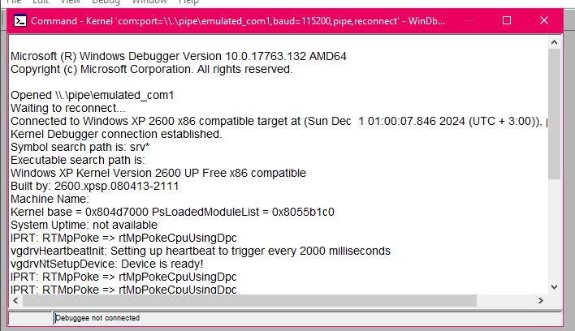
Если вы не видите подобный вывод - проверьте несколько раз имя порта и прочие шаги из предыдущих пунктов.

Следующее что нужно сделать это установить Guest Additions чтобы создать общую папку с хост машиной. Сделать это можно нажав в меню сверху Устройства -> Upgrade ISO guest...

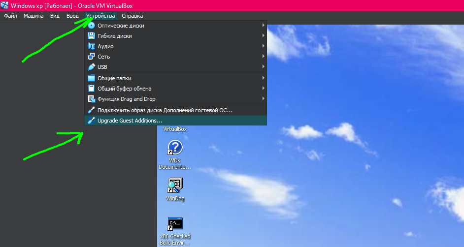

Дожидаемся окончания загрузки. После этого заходим в `Пуск -> Мой компьютер` - у вас должен появится диск с названием примерно `"Guest Additions"`. Открываем его и начинается установка Guest Additions. Нужны они нам кстати чтобы у нас был общий буфер обмена и чтобы мы могли создавать общие папки. Если короче - они нужны чтобы мы не замучились пользоваться виртуальной машиной.

Дальше выключаем машину, заходим в ее настройки и создаем общую папку. В нее мы положим код драйвера чтобы мы могли редактировать код и на виртуальной машине пытаться его собирать. В данном случае общая папка будет корень проекта на гите.

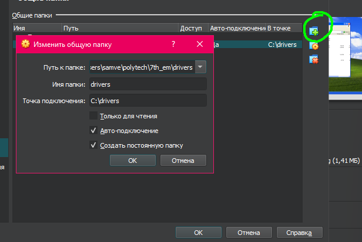

Общую папку можно найти в `Пуск -> Мой компьютер` в отдельном диске.

## Из чего состоит драйвер?

### Идея
Драйвер решает следующую задачу - он предоставляет интерфейс для работы с COM2 портом, настраивает его на низком уровне, тем самым лишает нас мучений работы с низкоуровневым OS API. Мы отправляем драйверу строчку - он записывает ее в ком порт.

Чтобы собрать драйвер нужны следующие файлы:
- driver.c (код драйвера)
- sources (местный Мейкфайл, содержит описание как собирать драйвер, из каких файлов)
- genport.inx (после компиляции он будет переделан в genport.inf)


## Собираем драйвер
Если у вас общая папка установилась как у меня в диск `Z:\`, то вам необходимо открыть `консоль на рабочем столе` и в ней перейти в папку `driver\sys`. Перейти можно с помощью команд:
```sh
Z:
cd driver
cd sys
```

С помощью команды `dir` можно узнать что внутри директории. Чтобы непосредственно собрать драйвер пишем следующее:
```sh
build -ceZ
```
Если сборка прошла успешно - вы должны увидеть папку `objchk_wxp_x86/i386` и в ней `genport.sys` вместе с файлом `genport.inf`.

Это первая часть нашего драйвера. Если заглянуть в код драйвера, то можно увидеть что при запуске он создает несколько устройств:
- *\\Device\\IoctlDevice*
- *\\DosDevices\\IoctlDevice*

Первое - это непосредственно имя нашего драйвера. Оно будет доступно только в режиме ядра - что значит пользователи не могут его использовать. Второе - это символическая ссылка на наш драйвер. Пользователи должны работать именно с ней.

## Загрузка драйвера
Чтобы загрузить драйвер в систему - необходимо перейти в папку `objchk_wxp_x86/i386` и воспользоваться командой:
```sh
c:\WinDDK\7600.16385.0\tools\devcon\i386\devcon.exe INSTALL .\genport.inf "root\portio"
```

Если всё пройдет успешно - выпрыгнет окно предлагающее указать путь до драйвера. Указываем путь до `genport.sys` файла который получился в результате компиляции в папке `objchk_wxp_x86/i386`. После этого драйвер будет загружен в систему и в WinDbg вы должны будете увидеть сообщение `COM2 port configured successfully.`

Если при загрузке у вас произошла ошибка - возможно вы забыли удалить предыдущий драйвер. В таком случае восопльзуйтесь командой и перезагрузитесь при необходимости:
```sh
c:\WinDDK\7600.16385.0\tools\devcon\i386\devcon.exe remove "root\portio"
```

So far наш драйвер загружен и готов к работе.

## Программа пользователя
Теперь необходимо написать программу чтобы послать строку в драйвер. Предварительно напишем скрипт на питоне который будет постоянно считывать строку из `\\.\pipe\emulated_com2`. Пример скрипта расположен в `driver/read_port.py`. Чтобы запустить его - необходимо установить библиотеку `pywin32` и запустить программу. Запускать его будет на хост(не виртуальной!) машине. Запускаем его - он переходит в режим ожидания данных.

Вторая программа нужна для непосредственной отправки драйвера и запускаться она будет на виртуальной машине. Пример программы написан в `driver/main.c`. Скомпилированный вариант программы под Windows XP x32 находится в `driver/write.exe`. Ее можно запустить прямо в виртуальной машине. Для этого переходим в папку `driver` и запускаем команду `.\write.exe`. Если все прошло успешно - вы должны увидеть сообщение `Hello, Serial Port!` в консоли. В приложении питона вы должны увидеть сообщение примерно `"Received data: Hello, Serial Port!"`.

# Troubleshooting
Если у вас ошибки компиляции - проверьте что в начале каждой функции вы объявляете переменные, их нельзя объявлять в середине кода потому что стандарт для языка C используется стандарт C89.

Примеры кодов драйверов расположены на виртуальной машине по пути `C:\WinDDK\7600.16385.0\src`. Код общения с портом лежит конкретно в `C:\WinDDK\7600.16385.0\src\general\portio`

# Author
Made by Alexander Abraamyan 17.11.2024 and 01.12.2024 - still alive sadly thanks to Polytech University.
