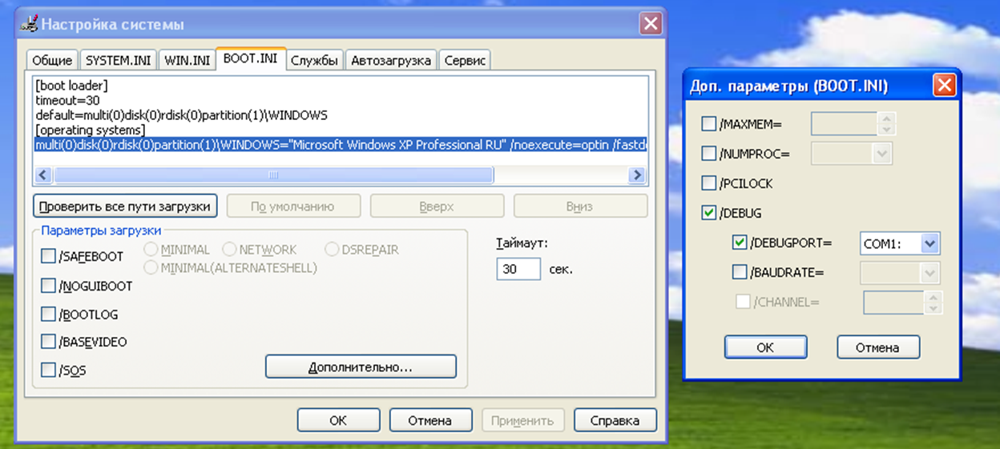

# Как сделать драйвер
# General info
Host machine - основной компьютер, НЕ виртуалка

# Prerequisites
On host machine:

- WinDbg
  С помощью него мы будем отлаживать при необходимости код и смотреть дебаг сообщения ядра

- Что нибудь чтобы писать код

- VirtualBox


Первое что вы должны сделать это с яндекс диска скачать [виртуальный диск](https://disk.yandex.ru/d/ha6y7_uLZfIUKQ) с яндекс диска Фёдора Михайловича. Дальше к нему еще необходимо скачать образ виртуальной машины Windows XP i386(x86) например [отсюда](https://windows64.net/dow.php?url=https://windows64.net/index.php?do=download&id=11). Я скачал вроде не пожалел. Дальше в виртуалбоксе вы должны создать машину, **обязательно** перейти в *экспертный режим* и в разделе диски выбрать скачанный ранее виртуальный диск.

Следующее что надо сделать это настроить порты в параметрах виртуальной машины. Необходимо выставить следующие параметры


В настройках системы на виртуалке надо выставить параметры как указано на рисунке

Этот порт будет использован для просмотра дебага из WinDbg. Также мы включаем параметр DEBUG чтобы видеть отладочную информацию. После этого необходимо перезапустить виртуальную машину

Следующее что нужно сделать это установить Guest Additions чтобы создать общую папку с хост машиной. Сделать это можно нажав в меню сверху Машина(вроде) -> Upgrade ISO guest чето там. Дальше появится еще один диск который можно запустить нажав на него. После этого заходим в параметры виртуальной машины и создаем общую папку. В ней мы будем писать код на основной системе и компилировать его на виртуалке

В этой папке необходимо создать папку driver(напрмиер). Заходим в нее.
Создаем файлы
- driver.c
- sources

В driver.c вставляется код драйвера. Файл sources играет роль Мейкфайла но со своим синтаксисом.

Чтобы собрать драйвер - необходимо запустить консоль на рабочем столе и через нее перейти в общую папку с драйвером. Перейти в папку где содержится файл sources и набрать следующую команду. Необходимо убедиться что ошибки нету и executable был собран успешно. Должна появиться папка objchk_wxp_x86/i386 или что то подобное. В неё должен быть файл .sys - это и есть драйвер.
```sh
build -ceZ
```

На хосте необходимо открыть WinDbg.
В нем надо сделать следующее
- Зайти в меню `File>Kernel Debug`, выбрать вкладку «COM»
- Установить имя порта `\\.\pipe\emulated_com1`, выставить флаги «Pipe» и «Reconnect», нажать ОК и запустить (перезапустить) целевую систему


Чтобы загрузить драйвер в систему - необходимо воспользоваться командой снизу.
Не забудьте поменять путь к драйверу
```sh
sc create MyDriver type= kernel binPath= Z:\driver\objchk_wxp_x86\i386\SimpleDriver.sys
sc start MyDriver
```

В WinDbg вы увидите сообщение о загрузке драйвера и об опросе состояния если используете мой вариант кода.

Чтобы удалить драйвер необходимо написать команду

```sh
sc delete MyDriver
```

# Troubleshooting
Обязательно зайдите в диспетчер устройств и убедитесь что у вас доступен порт `COM2`. Если он недоступен - удалите устройство и перезагрузите виртуальную машину.

Если у вас ошибки компиляции - проверьте что в начале каждой функции вы объявляете переменные, их нельзя объявлять в середине кода потому что стандарт для языка C используется стандарт C89.
